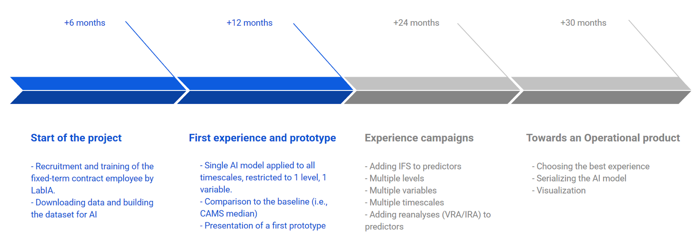

# CAMS_40_bis WP4067
_Deep Learning Ensemble poluant prediction_

## Context
This project's goal is to train a machine learning model to produce a ensemble prediction to replace the current CAMS median ensemble. This ensemble prediction takes into account the 11 european CTM (CTM meaning) models and covers 4 pollutants:
- Ozone (O3)
- Nitrogen dioxide (NO2)
- Sulfur dioxide (SO2)
- Particulate matter 10µm (PM10)

## Official mission description
The goal of this subtask is to test the performance of a Deep Learning model to produce a new product, that will be conventionally named Deep Learning ENSEMBLE. This product aims to replace the current Median ENSEMBLE, as the CAMS Regional flagship product. This one is expected to demonstrate improved performance compared to the current Median ENSEMBLE and the benchmarked Weighted Ensemble product. Models adapted to large three-dimensional datasets will be tested, including state-of-the-art convolutional neural networks (UNet, HalfUNet or DeepLabv3+)1 or vision transformers (SegFormer , SwinUNetR , UNetR++)9. If the performance is satisfactory, the designed approach will be smoothly transferred to an operational setup, meeting requirements in terms of robustness and computing demand.

For this task, a new staff member with a strong background in Python and AI development will be hired and integrated into the Meteo-France AI Lab team. This Lab consists of 4 AI experts who have already developed several operational Deep Learning products for Meteo-France (Cloud Cover Nowcasting , Espresso ).

The model development will be carried out as follows. CTM forecasts produced by Regional Systems will be used as predictive data (inputs to the model). The analysis (or reanalysis) product will be used as a predictand (target of the model). **The first year of work will be dedicated to the development of a first model valid for a few time steps and which will take as input a single parameter for a single level.** The performance of this first proof of concept will be compared to the Median ENSEMBLE and the Weighted ENSEMBLE. Since the quality of weather forecasts strongly impacts the quality of CTM forecasts5, the IFS model forecasts will be added to the predictors in the second phase of the project. Then the performance of a single AI model that predicts multiple variables and/or leadtimes and/or levels will be evaluated. The added value of the use of reanalyses (VRA/IRA) as predictand can also be explored, atlhough there are reservations due to the short period of availability of complete data.

All the steps of the project are detailled Figure 13). At the end of the project, the AI Lab will deliver the code in an open-source repository such as GitHub, which will explain how to preprocess data, train and perform an inference of the best model found following the experiments. Additionaly the training dataset and the weigths of the best model (essential for inference) will also be made freely available

Figure 13: Timeline of the work for DL-ENS development

The computing infrastructure used for these experiences, will be housed within Météo-France and managed by the experts of the AI Lab. The cluster is equipped with 28 GPU cards distributed across 6 distinct computing nodes. Five of these nodes feature 4 Nvidia V100 32GB GPUs each, paired with 40 CPU cores. The sixth node will be outfitted in 2025 with 8 Nvidia H100 80GB GPUs, coupled with 80 CPU cores. All the nodes are connected to a data storage with an Infiniband network. Development environments are managed using Docker.

It is noted that, by using the analysis (or reanalysis) product as a predictand, the performance of this new Deep Learning ENSEMBLE remains largely dependant on the quality of the CTM production. This clearly highlights the complementarity of physic and data driven approaches. But it also limits the expectations in terms of performances, as analysis & reanalysis products still have more limitations to capture exceedances than the current CAMS-MOS trained at stations.

This task will be distributed over the whole duration of the contract. The main deliverable will be the devoted technical note due in 2027, but the progress of work will also be reported in the annual reports of 2025 and 2026. Outcomes from Subtask 1 and 2 are planned to be implemented operationally in WP4023/WP4024 after additional evaluation performed in WP4033. Furthermore, as described in Figure 13 a prototype for Subtask 2 will be made available 12 months after the strat of the contract.
