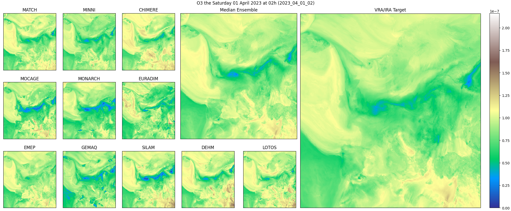

# Dataset

Data for this project is expected to be organized like so:
```txt
.
└── CAMS_DATASET_DIR
    ├── raw
    │   └── # raw data
    ├── processed
    │   └── # processed data
    ├── logs
    │   └── # training logs, generated by lightining
    └── species_stats.json  # Stats file with min, max, mean, used for normalization
```

Throughout the project, these paths are references using the constant defined
in the [`cams/settings.py`](../cams/settings.py) file.

## Raw data

A large amount of raw meteorological data is necessary to train the cams
deeplearning ensemble model. Here is a description of the data that should be
gathered, and how to organize it so that it can be preprocessed for training.

This project's preprocessing script expects data organized like so, with the
following naming conventions:
- **`YYYY_MM_DD`** specifies a date ordered with year, month then day,
    spearated with `_` characters and zero padded on the left.
- **`LT`** = leadtime, a zero paded number between 0 and 96.
- **`LVL`** = level, one of 0, 50, 100, 250, 500, 750, 1000, 2000, 3000, 5000.
- **`SPECIESID`** = a species BDAP id such as specified [here](dataset.md),
    without the suffix `_USI`.
```txt
.
└── raw
    ├── reanalisis
    │   └── SPECIESID
    │       └── YYYY_MM_LVLm.netcdf
    ├── PMACCCHIMERE
    │   └── YYYY_MM_DD_LT_LVL_SPECIESID.grib
    ├── PMACCDEHM
    │   └── YYYY_MM_DD_LT_LVL_SPECIESID.grib
    ├── PMACCEMEP
    │   └── YYYY_MM_DD_LT_LVL_SPECIESID.grib
    ├── PMACCEURADIM
    │   └── YYYY_MM_DD_LT_LVL_SPECIESID.grib
    ├── PMACCGEMAQ
    │   └── YYYY_MM_DD_LT_LVL_SPECIESID.grib
    ├── PMACCLOTOS
    │   └── YYYY_MM_DD_LT_LVL_SPECIESID.grib
    ├── PMACCMATCH
    │   └── YYYY_MM_DD_LT_LVL_SPECIESID.grib
    ├── PMACCMINNI
    │   └── YYYY_MM_DD_LT_LVL_SPECIESID.grib
    ├── PMACCMOCAGE
    │   └── YYYY_MM_DD_LT_LVL_SPECIESID.grib
    ├── PMACCMONARCH
    │   └── YYYY_MM_DD_LT_LVL_SPECIESID.grib
    └── PMACCSILAM
        └── YYYY_MM_DD_LT_LVL_SPECIESID.grib
```

Files in folders named with a CTM model name contain input data for 1 model
run, 1 leadtime, 1 species and all levels. They are `.grib files that can be
opened using python like so:
```py
>>> import xarray as xr
>>> dataarray = xr.open_dataarray("PMACCCHIMERE/2023_07_27_15_O3.grib")
>>> dataarray
<xarray.DataArray 'unknown' (latitude: 420, longitude: 700)> Size: 1MB
[294000 values with dtype=float32]
Coordinates:
  * latitude    (latitude) float64 3kB 71.95 71.85 71.75 ... 30.25 30.15 30.05
  * longitude   (longitude) float64 6kB -24.95 -24.85 -24.75 ... 44.85 44.95
    time        datetime64[ns] 8B ...
    step        timedelta64[ns] 8B ...
    surface     float64 8B ...
    valid_time  datetime64[ns] 8B ...
Attributes: (12/30)
    GRIB_paramId:                             0
    GRIB_dataType:                            fc
    GRIB_numberOfPoints:                      294000
    GRIB_typeOfLevel:                         surface
    GRIB_stepUnits:                           1
    GRIB_stepType:                            instant
    ...                                       ...
    GRIB_name:                                unknown
    GRIB_shortName:                           unknown
    GRIB_units:                               unknown
    long_name:                                unknown
    units:                                    unknown
    standard_name:                            unknown
```

Files in the `reanalisis` folder contain the reanalisis target data,
1 species, 1 month and one level. They are `.netcdf` files that can be opened
using python like so:
```py
>>> import xarray as xr
>>> import earthkit.data as ekd
>>> source = ekd.from_source("file", "reanalisis/O3_USI/2022_05_0m.netcdf")
>>> data_array: xr.DataArray = source.to_xarray().to_dataarray()[0]
>>> data_array
<xarray.DataArray (time: 744, lat: 420, lon: 700)> Size: 875MB
dask.array<getitem, shape=(744, 420, 700), dtype=float32, chunksize=(744, 420, 700), chunktype=numpy.ndarray>
Coordinates:
  * time      (time) datetime64[ns] 6kB 2022-05-01 ... 2022-05-31T23:00:00
  * lat       (lat) float64 3kB 30.05 30.15 30.25 30.35 ... 71.75 71.85 71.95
  * lon       (lon) float64 6kB -24.95 -24.85 -24.75 ... 44.75 44.85 44.95
    variable  <U2 8B 'o3'
Attributes:
    Conventions:  CF-1.7
    Title:        CAMS European air quality validated reanalysis
    Provider:     COPERNICUS European air quality service
    Production:   COPERNICUS Atmosphere Monitoring Servic
```

## Processed data
The raw data need to be processed before being usable for training.
Data processing can be done with:
```sh
python scripts/data_processing.py \
    --raw_folder <path/to/raw/folder> \
    --output_folder <path/to/output/folder>
```

Once processing done, training ready data are ordered like so:
```txt
.
└── processed
    ├── input
    │  └── YYYY_MM_DD.netcdf
    └── target
      └── YYYY_MM_DD_HH.netcdf
```

Processed data can be opened like so:
```py
>>> import xarray as xr
>>> xr.open_dataarray("processed_data/input/2023_12_18.netcdf")
<xarray.DataArray 'unknown' (model: 11, species: 1, level: 1, leadtime: 1,
                             latitude: 420, longitude: 700)> Size: 13MB
array([[[[[[ 75.52883 ,  75.958115,  74.04817 , ...,  79.07222 ,
             79.7889  ,  81.11313 ],
           [ 73.62617 ,  69.89724 ,  67.09236 , ...,  82.97578 ,
             84.31819 ,  85.89707 ],
           [ 60.68588 ,  61.235214,  61.52989 , ...,  80.44738 ,
             82.46645 ,  84.73292 ],
           ...,
           [ 60.62767 ,  62.80318 ,  63.385258, ..., 122.52424 ,
            126.23862 , 126.56967 ],
           [ 60.634945,  61.76272 ,  62.42847 , ..., 122.29868 ,
            125.64563 , 126.00942 ],
           [ 60.85686 ,  61.74817 ,  62.421192, ..., 121.93125 ,
            124.59425 , 124.81981 ]]]]],


       [[[[[ 67.404686,  70.08944 ,  72.73593 , ...,  72.37322 ,
             73.19843 ,  73.53374 ],
           [ 69.367386,  70.92021 ,  71.78389 , ...,  71.51286 ,
...
           [ 40.661354,  40.690247,  40.726784, ..., 106.62416 ,
            106.81082 , 106.52696 ]]]]],


       [[[[[ 82.795525,  82.795525,  81.61274 , ...,  66.989815,
             67.65971 ,  68.32961 ],
           [ 80.04325 ,  77.368515,  77.05689 , ...,  66.989815,
             66.989815,  67.65971 ],
           [ 77.368515,  78.685875,  79.83399 , ...,  66.989815,
             66.989815,  66.989815],
           ...,
           [ 62.065624,  62.779022,  63.49242 , ..., 132.15439 ,
            130.26646 , 130.26646 ],
           [ 60.63884 ,  62.065624,  62.779022, ..., 130.26646 ,
            128.69698 , 128.43173 ],
           [ 59.925426,  61.352226,  62.065624, ..., 131.83595 ,
            128.69698 , 128.43173 ]]]]]],
      shape=(11, 1, 1, 1, 420, 700), dtype=float32)
Coordinates:
  * model       (model) <U12 528B 'PMACCCHIMERE' 'PMACCDEHM' ... 'PMACCSILAM'
  * species     (species) <U2 8B 'O3'
  * level       (level) <U1 4B '0'
  * leadtime    (leadtime) <U2 8B '15'
  * latitude    (latitude) float64 3kB 71.95 71.85 71.75 ... 30.25 30.15 30.05
  * longitude   (longitude) float64 6kB -24.95 -24.85 -24.75 ... 44.85 44.95
    time        datetime64[ns] 8B 2024-05-26
    step        timedelta64[ns] 8B 15:00:00
    surface     float64 8B 0.0
    valid_time  datetime64[ns] 8B 2024-05-26T15:00:00
Attributes: (12/30)
    GRIB_paramId:                             0
    GRIB_dataType:                            fc
    GRIB_numberOfPoints:                      294000
    GRIB_typeOfLevel:                         surface
    GRIB_stepUnits:                           1
    GRIB_stepType:                            instant
    ...                                       ...
    GRIB_name:                                unknown
    GRIB_shortName:                           unknown
    GRIB_units:                               unknown
    long_name:                                unknown
    units:                                    unknown
    standard_name:                            unknown
>>> xr.open_dataarray("processed_data/target/2023_12_21_15.netcdf")
<xarray.DataArray '2024_05_26_15 reanalisis' (species: 1, level: 1, lat: 420,
                                              lon: 700)> Size: 1MB
array([[[[ 70.589096,  72.10544 ,  72.990875, ...,  70.14551 ,
           70.08887 ,  69.83008 ],
         [ 69.64901 ,  71.57346 ,  72.76011 , ...,  69.56738 ,
           69.60742 ,  69.59961 ],
         [ 67.513435,  67.72452 ,  69.90242 , ...,  69.21326 ,
           69.40798 ,  69.14844 ],
         ...,
         [ 54.25    ,  54.48166 ,  54.725433, ..., 112.41094 ,
          112.68443 , 113.4682  ],
         [ 53.847656,  54.14258 ,  54.74739 , ..., 112.41508 ,
          112.66978 , 113.30313 ],
         [ 53.29117 ,  53.47168 ,  53.662224, ..., 112.98573 ,
          113.166435, 113.46041 ]]]],
      shape=(1, 1, 420, 700), dtype=float32)
Coordinates:
  * species   (species) <U2 8B 'O3'
  * level     (level) <U1 4B '0'
  * lat       (lat) float64 3kB 71.95 71.85 71.75 71.65 ... 30.25 30.15 30.05
  * lon       (lon) float64 6kB -24.95 -24.85 -24.75 ... 44.75 44.85 44.95
    time      datetime64[ns] 8B 2024-05-26T15:00:00
    variable  <U2 8B 'o3'
Attributes:
    Conventions:  CF-1.7
    Title:        CAMS European air quality interim reanalysis
    Provider:     COPERNICUS European air quality service
    Production:   COPERNICUS Atmosphere Monitoring Service
    units:        µg/m3
```

Processed data can be represented with the `plot.py` script:
```sh
python scripts/plot_sample.py --date YYYYMMDDLT
```


